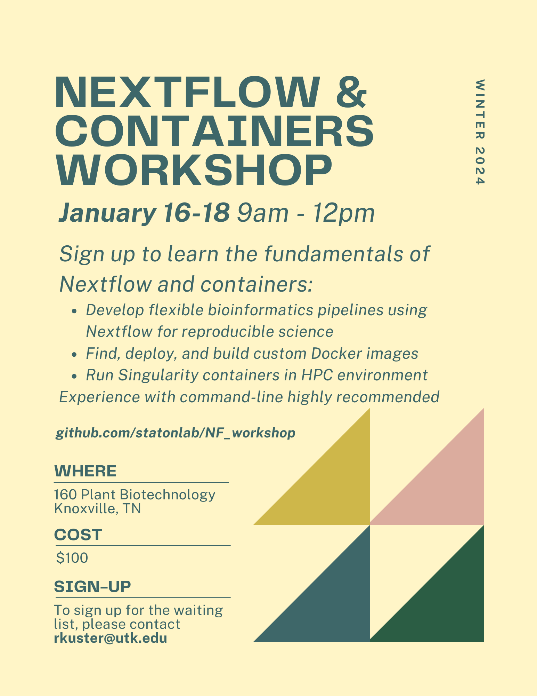

# :warning: NOTICE: Workshop Postponed

Due to inclement weather, the workshop has been postponded to January 23 - 25 in Plant Biotechnology Building room 223.

# Nextflow and Containers Workshop

For course content, please see the [wiki](https://github.com/ryandkuster/NF_workshop/wiki).

---

Welcome to the 2024 Nextflow and Container Workshop! This workshop is being offered to all UTK students, staff, and faculty as an introductory, three day dive into using Nextflow for developing bioinformatics pipelines and learning the fundamentals of container use with Docker and Singularity.

The workshop cost is $100 per attendee.

Interested? Contact rkuster@utk.edu.

*This workshop is contingent on enrollment, so please don't hesitate to request a spot!*

